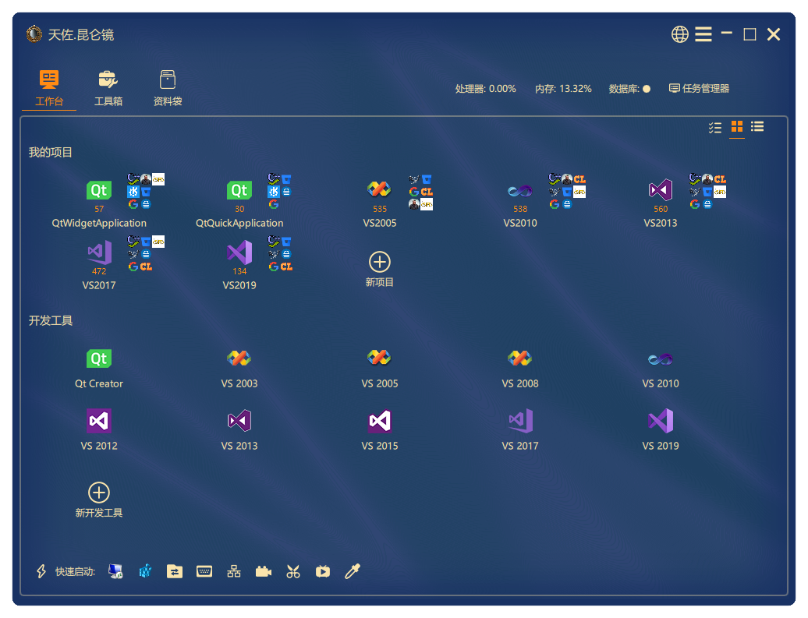
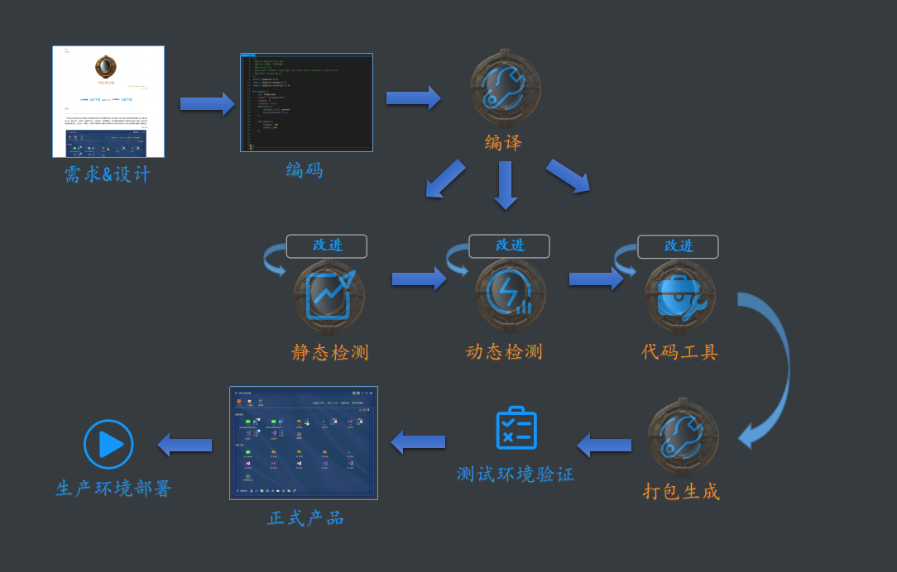

<h4 align="right">简体中文 | <strong><a href="README_en.md">English</a></strong></h4>

    
    
天佐.昆仑镜

程序员的超强本地构建工具
 
永久免费
 
 
 
 

　<a href="https://pan.baidu.com/s/1Abnr2yTAHukV8AyX2-ZK1A?pwd=1234"  style="font-size:28px;" target="_blank">立即下载</a>　　　<a href="https://share.weiyun.com/1WNeAnwL" style="font-size:28px;" target="_blank">立即下载</a>

 
 
 简介

　天佐.昆仑镜, 强大的本地构建工具, 提供给项目全方位的静态检测, 动态检测, 代码工具以及各种便利的插件工具, 通过词法分析、语法分析、控制流、数据流分析、内存检测、代码覆盖率、热点函数检测等技术对程序代码进行扫描，验证代码是否满足规范性、安全性、可靠性、可维护性等指标. 根据分析结果对代码进行深度优化. 提升代码质量, 增强产品健壮性.

    

    

 
工作台  

      项目指标 统计出项目的各种指标, 作为衡量项目复杂度的部分标准

      编译运行 可以手动或自动化编译项目

      静态检测 通过词法分析、语法分析、控制流、数据流分析等技术对程序代码进行扫描，检查代码和设计的一致性，代码对标准的遵循、可读性，代码的逻辑表达的正确性，代码结构的合理性等方面

      动态检测 通过内存检测、代码覆盖率、热点函数检测等技术根据分析结果对代码进行深度优化. 提升代码质量, 增强产品健壮性

      代码工具 自动化代码格式化, 生成项目文档
 
 
工具箱  

      各种工具 涵盖通讯/图形/设计/转换/生成/杂项等各方面的小工具
 
 
资料袋  

      代码库 可记录平时常用的代码到资料袋, 随时查阅浏览拷贝

# 支持 

### 支持内容 
<table>
  <tr>
    <td width="10%">名称</td>
    <td width="20%">支持</td>
	<td width="20%">开发中</td>
  </tr>
  <tr>
    <td>操作系统</td>
    <td> Windows7/8/10   </td>
	<td></td>
  </tr>
  <tr>
    <td>编程语言</td>
    <td> </td>
	<td>       </td>
  </tr>
  <tr>
    <td>项目类型</td>
    <td> Qt 
	 VS2003-VS2019</td>	
	<td> </td>
  </tr>
</table>

# 服务 

　　软件开发: 长期提供C++ Qt Qml全平台软件开发服务
 
　　定制开发: 长期提供天佐.昆仑镜定制开发服务
 
　　代码优化: 为企业和个人提供C++/Qt/Qml代码优化服务

# 关于我们 

### 联系方式 

<table>
  <tr>
    <td width="10%">作者</td>
    <td width="20%">郑天佐</td>
  </tr>
  <tr>
    <td>QQ</td>
    <td>278969898</td>
  </tr>
  <tr>
    <td>邮箱</td>
    <td>camelsoft@163.com</td>
  </tr>
  <tr>
    <td>主页</td>
    <td><a class="httplink" href="http://www.camelstudio.cn">http://www.camelstudio.cn</a></td>
  </tr>
  <tr>
    <td>博客</td>
    <td><a class="httplink" href="http://blog.csdn.net/zhengtianzuo06">http://blog.csdn.net/zhengtianzuo06</a></td>
  </tr>
  <tr>
    <td>github</td>
    <td><a class="httplink" href="https://github.com/zhengtianzuo">https://github.com/zhengtianzuo</a></td>
  </tr>
  <tr>
    <td>gitee</td>
    <td><a class="httplink" href="https://gitee.com/zhengtianzuo">https://gitee.com/zhengtianzuo</a></td>
  </tr>
  <tr>
    <td>QQ群</td>
    <td>199672080</td>
  </tr>
</table>

    

 
<table style='table-layout:fixed;'>
  <tr>
  <td align='center' width="10%">加QQ好友</td>
  <td align='center' width="10%">加微信好友</td>
  <td align='center' width="10%">扫码提问</td>
  <td align='center' width="10%">微信打赏</td>
  <td align='center' width="10%">支付宝打赏</td>
  </tr>
</table>

### 我们的愿景 
　　愿景: 程序员的超强本地构建工具
 
　　使命: 创造价值，成就客户，服务行业
 
　　价值观: 挖掘功能，集大成者，精准服务
