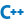

<h4 align="right"><strong><a href="README.md">简体中文</a></strong> | English</h4>

    
    
tianzuo.Kunlun

Programmer's powerful local build tool
 
permanently free
 
 
 
 

　<a href="https://pan.baidu.com/s/1Abnr2yTAHukV8AyX2-ZK1A?pwd=1234"  style="font-size:28px;" target="_blank">download now</a>　　　<a href="https://share.weiyun.com/1WNeAnwL" style="font-size:28px;" target="_blank">download now</a>

 
 
 introduction

　tianzuo.Kunlun, powerful local construction tools, provides all-round static detection, dynamic detection, code tools and various convenient plug-in tools for the project. Scan the program code through lexical analysis, syntax analysis, control flow, data flow analysis, memory detection, code coverage, hot function detection and other technologies to verify whether the code meets the standardization Safety, reliability, maintainability and other indicators. Deeply optimize the code according to the analysis results, improve the code quality and enhance the robustness of the product.

    

    

 
workbench  
 
      Project indicators Various indicators of the project are counted as part of the standard to measure the complexity of the project
 
      Compile run Projects can be compiled manually or automatically
 
      Static Analysis Scan the program code through lexical analysis, syntax analysis, control flow, data flow analysis and other technologies to check the consistency between the code and the design, the compliance and readability of the code to the standard, the correctness of the logical expression of the code, and the rationality of the code structure
 
      Dynamic Analysis Through memory detection, code coverage, hotspot function detection and other technologies, the code is deeply optimized according to the analysis results, so as to improve the code quality and enhance the robustness of the product
 
      Code Tools Automate code formatting and generate project documents
 
 
toolbox  
 
      Various Tools Gadgets covering communication / graphics / design / conversion / generation / miscellaneous, etc
 
 
data bag  
 
      Code Base You can record the commonly used codes to the data bag and browse the copy at any time

# support 

### Support content 
<table>
  <tr>
    <td width="10%">name</td>
    <td width="20%">support</td>
	<td width="20%">developing</td>
  </tr>
  <tr>
    <td>operating system</td>
    <td> Windows7/8/10   </td>
	<td></td>
  </tr>
  <tr>
    <td>programing language</td>
    <td></td>
	<td>  </td>
  </tr>
  <tr>
    <td>project type</td>
    <td> Qt 
	 VS2003-VS2019</td>	
	<td> </td>
  </tr>
</table>

# Service 

　　software development: Long - term C++ Qt Qml platform software development services
 
　　customized development: Long - term tianzuo.Kunlun customized development services
 
　　code optimization: C++/Qt/Qml code optimization services for enterprises and individuals

# About us 

### contact information 

<table>
  <tr>
    <td width="10%">author</td>
    <td width="20%">zhengtianzuo</td>
  </tr>
  <tr>
    <td>QQ</td>
    <td>278969898</td>
  </tr>
  <tr>
    <td>mailbox</td>
    <td>camelsoft@163.com</td>
  </tr>
  <tr>
    <td>homepage</td>
    <td><a class="httplink" href="http://www.camelstudio.cn">http://www.camelstudio.cn</a></td>
  </tr>
  <tr>
    <td>blog</td>
    <td><a class="httplink" href="http://blog.csdn.net/zhengtianzuo06">http://blog.csdn.net/zhengtianzuo06</a></td>
  </tr>
  <tr>
    <td>github</td>
    <td><a class="httplink" href="https://github.com/zhengtianzuo">https://github.com/zhengtianzuo</a></td>
  </tr>
  <tr>
    <td>gitee</td>
    <td><a class="httplink" href="https://gitee.com/zhengtianzuo">https://gitee.com/zhengtianzuo</a></td>
  </tr>
  <tr>
    <td>QQ group</td>
    <td>199672080</td>
  </tr>
</table>

    

 
<table style='table-layout:fixed;'>
  <tr>
  <td align='center' width="10%">Add QQ Friends</td>
  <td align='center' width="10%">Add WeChat Friends</td>
  <td align='center' width="10%">Paid Questions</td>
  <td align='center' width="10%">WeChat Sponsor</td>
  <td align='center' width="10%">Alipay Sponsor</td>
  </tr>
</table>

### Our vision 
　　vision: Programmer's powerful local build tool
 
　　mission: Create value, achieve customers and serve the industry
 
　　sense of worth: Mining functions, integrators and accurate services
